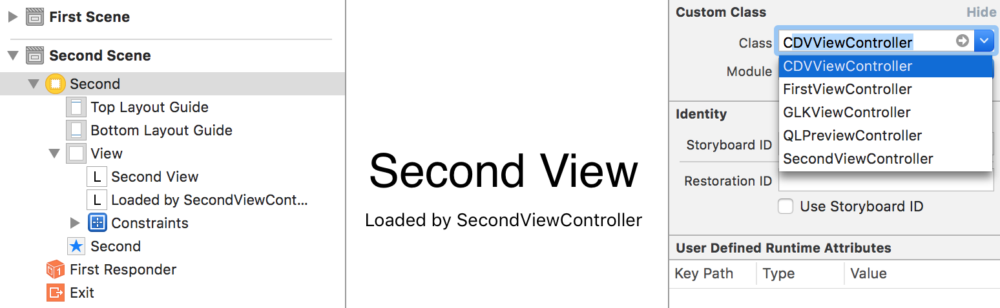

Cordova iOS - step 3
====================
Embedding the Cordova WebView

## Fixing the storyboard
- In Xcode open `<YourAppName>/Main.storyboard`
- Remove the 'View' node from the 'Second scene' otherwise the native label will overlay the webview - select the view and hit delete on your keyboard
- Select the ViewController in the `Second scene` as shown in the screenshot below and change the `Custom class` to `CDVViewController`:

## Updating the www folder
- Copy the contents of the `resources` folder of step 3 by opening Xcode and go to `Pods` > `phonegap-ios-template` > `Resources`
- Right-click the `www` folder and 'Open in Finder'
- Now copy the files, replacing anything already there. 
- Now browse to the `cordova-plugin-pgdayeu16` folder and copy all files inside the `www` folder.
- Paste that to your project's `www` folder as well.

## Check the result
Run the app, select the second tab, and press 'Device' - you should now see this:

