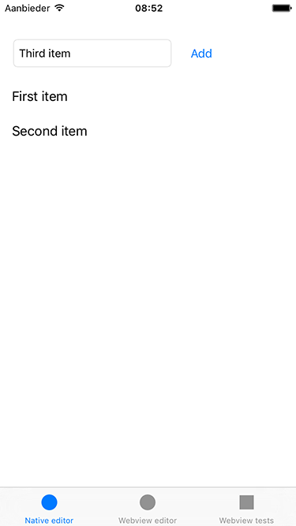
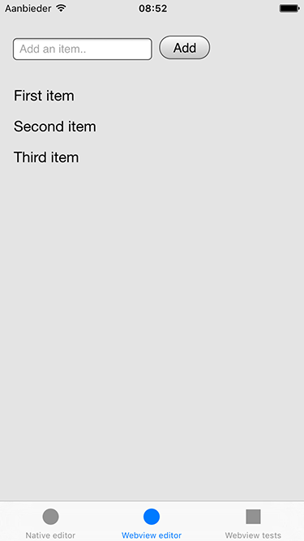

Cordova iOS - step 5
====================
Adding a custom plugin for web-native communication

__This is a lot of stuff so you might want to just grab the code folder instead of following along__

When these steps have been completed you'll end up with this:


## Let's add a plugin
We'll do this one manually (as opposed to using CocoaPods) as that's also useful to learn.

- In Xcode right-click your project (top left) and select `New Group`, call it `cordova-plugin-pgdayeu16`
- Right-click that new folder and click `New file...`, select `iOS` > `Source` > `Header File`, name it `PGDayEU16Plugin.h` and paste these contents:

```objective-c
#import <Cordova/CDVPlugin.h>

@interface PGDayEU16Plugin : CDVPlugin

- (void) retrieveList:(CDVInvokedUrlCommand*)command;
- (void) addToList:(CDVInvokedUrlCommand*)command;

@end
```

- Right-click the folder again and click `New file...`, select `iOS` > `Source` > `Objective-C File`, name it `PGDayEU16Plugin.m` (select your app's target when asked!) and paste these contents:

```objective-c
#import "PGDayEU16Plugin.h"
#import "CordovaListEditorViewController.h"
#import "FirstViewController.h"

static NSString *const kPluginOptionItem = @"item";

@implementation PGDayEU16Plugin

- (void) retrieveList:(CDVInvokedUrlCommand*)command {
  // fetch the native editor which holds the list of items
  FirstViewController* fvc = [self viewController].tabBarController.viewControllers[0];

  CDVPluginResult * pluginResult = [CDVPluginResult resultWithStatus:CDVCommandStatus_OK messageAsArray:fvc.items];
  [self.commandDelegate sendPluginResult:pluginResult callbackId:command.callbackId];
}

- (void) addToList:(CDVInvokedUrlCommand*)command {
  NSDictionary * args = [command.arguments objectAtIndex:0];
  NSString * item = args[kPluginOptionItem];
  if (item == nil) {
    CDVPluginResult * pluginResult = [CDVPluginResult resultWithStatus:CDVCommandStatus_ERROR messageAsString:@"item is required"];
    [self.commandDelegate sendPluginResult:pluginResult callbackId:command.callbackId];
    return;
  }

  // fetch the native editor which holds the list of items we want to add this item to
  FirstViewController* fvc = [self viewController].tabBarController.viewControllers[0];
  [fvc.items addObject:item];
  [fvc.tableView reloadData];

  CDVPluginResult* pluginResult = [CDVPluginResult resultWithStatus:CDVCommandStatus_OK];
  [self.commandDelegate sendPluginResult:pluginResult callbackId:command.callbackId];
}

@end
```

__Don't worry if stuff doesn't compile (it won't)__

- Go to `Pods` > `phonegap-ios-template` > `Resources` and open `config.xml`, then add this somewhere near the other `<feature>` tags:

```xml
    <feature name="PGDayEU16Plugin">
      <param name="ios-package" value="PGDayEU16Plugin" />
    </feature>
```

- Go to `Pods` > `phonegap-ios-template` > `Resources` > `www` and open `cordova_plugins.js`, then add this to the top:
```js
        {
            "file": "plugins/cordova-plugin-pgdayeu16/www/PGDayEU16Plugin.js",
            "id": "cordova-plugin-pgdayeu16.PGDayEU16Plugin",
            "pluginId": "cordova-plugin-pgdayeu16",
            "clobbers": [
                "window.PGDayEU16Plugin"
            ]
        },
```

You have now added the Cordova plugin native files, the JS bridge and the necessary wiring, bravo!

## Let's use the plugin
The plugin has two functions: `retrieveList` and `addToList`.

For both web and native we will create a view with an input field and a list and the idea is to sync those lists.

The current native ViewController will become the native editor, for the web editor we'll add a third tab.

### The native view
Open up `FirstViewController.h` and replace its contents by:

```objective-c
#import <UIKit/UIKit.h>

@interface FirstViewController : UIViewController<UITableViewDelegate, UITableViewDataSource>

@property (nonatomic, strong) NSMutableArray * items;
@property (nonatomic, strong) UITextField * textField;
@property (nonatomic, strong) UITableView * tableView;

@end
```

Now open `FirstViewController.m` and replace its contents by:

```objective-c
#import "FirstViewController.h"
#import "CordovaListEditorViewController.h"

@interface FirstViewController ()

@end

@implementation FirstViewController

- (instancetype)initWithCoder:(NSCoder *)coder {
  self = [super initWithCoder:coder];
  _items = [NSMutableArray new];
  [_items addObject:@"First item"];
  [_items addObject:@"Second item"];
  return self;
}

- (void)viewDidLoad {
  [super viewDidLoad];

  // add the UI programmatically instead of via storyboard so it's easy to just copy-paste
  [self addTextField];
  [self addButton];
  [self addTable];
}

- (void) addTextField {
  _textField = [[UITextField alloc] initWithFrame:CGRectMake(17, 50, 200, 35)];
  _textField.borderStyle = UITextBorderStyleRoundedRect;
  _textField.placeholder = @"Add an item..";
  _textField.autocorrectionType = UITextAutocorrectionTypeNo;
  _textField.font = [UIFont systemFontOfSize:14];
  [self.view addSubview:_textField];
}

- (void) addButton {
  UIButton *button = [UIButton buttonWithType:UIButtonTypeRoundedRect];
  button.frame = CGRectMake(230, 50, 50, 35);
  [button setTitle:@"Add" forState:UIControlStateNormal];
  [button addTarget:self action:@selector(buttonPressed) forControlEvents:UIControlEventTouchUpInside];
  [self.view addSubview:button];
}

- (void) addTable {
  CGFloat tabBarHeight = self.tabBarController.tabBar.frame.size.height;
  CGRect frame = CGRectMake(0, 100, self.view.bounds.size.width, self.view.bounds.size.height-100-tabBarHeight);
  self.tableView = [[UITableView alloc] initWithFrame:frame style:UITableViewStylePlain];
  self.tableView.separatorStyle = UITableViewCellSeparatorStyleNone;
  self.tableView.delegate = self;
  self.tableView.dataSource = self;
  [self.view addSubview:self.tableView];
}

- (void) buttonPressed {
  if (![_textField.text isEqualToString:@""]) {
    [_items addObject:_textField.text];
    _textField.text = @"";
    [_tableView reloadData];

    // fetch the web editor which we need to send an event to JS
    CordovaListEditorViewController* cvc = self.tabBarController.viewControllers[1];
    [cvc notifyWebview];
  }
}

#pragma mark UITableViewDataSource implementation
- (NSInteger)numberOfSectionsInTableView:(UITableView *)tableView {
  return 1;
}

- (NSInteger)tableView:(UITableView *)tableView numberOfRowsInSection:(NSInteger)section {
  return [_items count];
}

- (UITableViewCell *)tableView:(UITableView *)tableView cellForRowAtIndexPath:(NSIndexPath *)indexPath {
  static NSString *CellIdentifier = @"Cell";
  UITableViewCell *cell = [tableView dequeueReusableCellWithIdentifier:CellIdentifier];
  if (cell == nil) {
    cell = [[UITableViewCell alloc] initWithStyle:UITableViewCellStyleDefault reuseIdentifier:CellIdentifier];
  }
  cell.textLabel.text = [_items objectAtIndex:indexPath.row];
  return cell;
}

- (void)didReceiveMemoryWarning {
  [super didReceiveMemoryWarning];
  // Dispose of any resources that can be recreated.
}

@end
```

### The webview

- Right-click your app's group (or anywhere else you want this file) and click `New file...`, select `iOS` > `Source` > `Header File`, name it `CordovaListEditorViewController.h` and paste these contents:

```objective-c
#import <UIKit/UIKit.h>
#import <Cordova/CDVViewController.h>

@interface CordovaListEditorViewController : CDVViewController

- (void)notifyWebview;

@end
```

- Right-click the folder again and click `New file...`, select `iOS` > `Source` > `Objective-C File`, name it `CordovaListEditorViewController.m` (select your app's target when asked!) and paste these contents:

```objective-c
#import "CordovaListEditorViewController.h"

@interface CordovaListEditorViewController ()

@end

@implementation CordovaListEditorViewController

- (void)viewDidLoad {
  // we don't want the default "index.html" for this ViewController
  [self setStartPage:@"listeditor.html"];
  [super viewDidLoad];
  // Do any additional setup after loading the view, typically from a nib.
}

- (void)notifyWebview {
  // calling a specific method is a bit too tightly coupled but it serves our purpose of showing how to do native-web comms
  [self.webViewEngine evaluateJavaScript:@"retrieveList()" completionHandler:nil];
}

- (void)viewWillAppear:(BOOL)animated
{
  CGRect viewBounds = self.view.bounds;
  CGFloat tabBarHeight = self.tabBarController.tabBar.frame.size.height;
  CGRect webViewBounds = CGRectMake(viewBounds.origin.x,
                                    viewBounds.origin.y,
                                    viewBounds.size.width,
                                    viewBounds.size.height - tabBarHeight);

  self.webView.frame = webViewBounds;
  self.webView.backgroundColor = [UIColor clearColor];

  [super viewWillAppear:animated];
}

- (void)didReceiveMemoryWarning {
  [super didReceiveMemoryWarning];
  // Dispose of any resources that can be recreated.
}

@end
```

- Add a tab by opening `Main.storyboard` and dragging a `ViewController` onto a blank spot of the canvas
- Hold the `ctrl` key and drag from the 'Tab Bar Controller' to the new ViewController and pick 'Relationship Segue' > 'view controllers' - that should add a new tab bar item
- Select the new Scene you added and change the `Custom class` to `CordovaListEditorViewController` (which you just added)
- The tab bar now has three items - drag the new one (third tab) to the middle so it's second

__FINISH__

You made it - When you now run the app you should have 3 tabs and a working list editor which syncs between web and native!

  

If you want to add some sugar and learn more, [continue to step 6](../step6-adding-a-webview-loading-indicator) :)